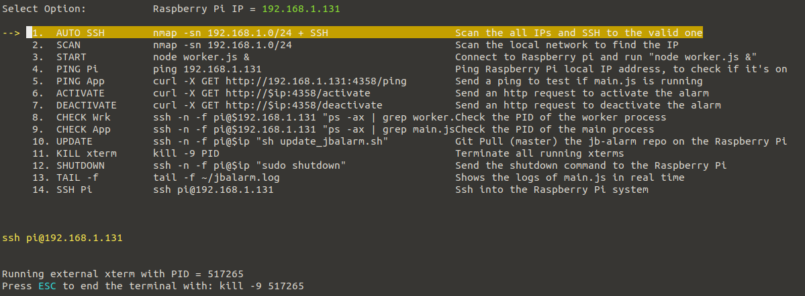
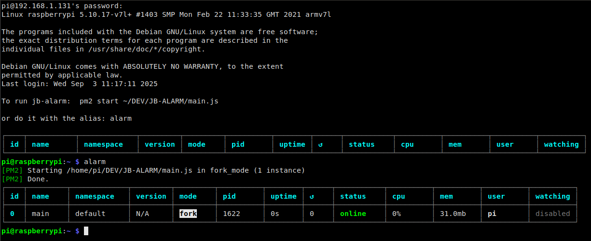
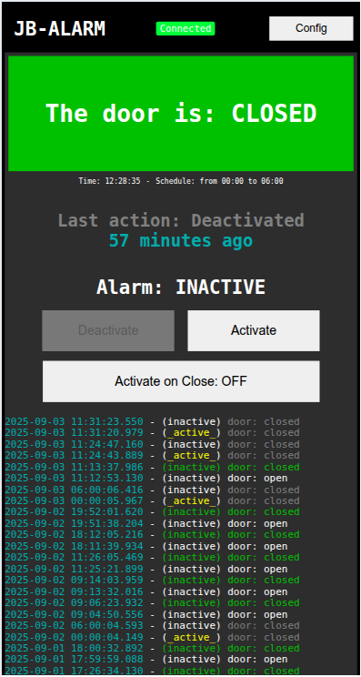

# JB-Alarm

Home made alarm system.

This is a set of programs that are meant to control the **alarm system** at home.
There are 3 different parts:
- `main.js` → The watcher, running on a Raspberry Pi.
- `menu.js` → A node.js terminal menu to remote control the system.
- `ui/` → A web client to monitor and control the system.

## Quick Setup:

You can use `node menu.js` to run the menu, select **AUTO SSH** to scan all your local IPs and ssh into your Raspberry Pi:



There you can keep your `main.js` process running using [PM2](https://pm2.keymetrics.io/docs/usage/process-management/)



You can manage the proces with PM2 with:
```
pm2 start ~/DEV/JB-ALARM/main.js      # Start it
pm2 stop main                         # Stop it
pm2 delete main                       # Stop it and remove it from the monitor list
pm2 list                              # Show the current status
```


## Backend

This project works with **Firebase** (Google Cloud), using its real time DB (Firestore).<br/>
To run it you need a `secrets.ts` file where to export your `firebaseConfig` object. 

There is one collection `doorlogs[]` where a log is pushed to every time a change happens.
A change can be of 2 types: 
- change: **'door'**   --> When the status of the door changes from/to `open` <-> `closed`
- change: **'alarm'**  --> When the status of the alarm changes from/to `active` <-> `inactive`

There are 4 additional documents that are only for control (not part of the logs)
They have a fix ID, and are never deleted (only modified)

- `000CTRL_door_status`     door  = open|closed           This reflects the current status of the door

- `000CTRL_alarm_status`    alarm = active|inactive       This reflects the current status of the alarm

- `000CTRL_main_app`        This is updated every 30 seconds with the current time by main.js, so clients can know if the process is up or down.

- `000CTRL_schedule`        activation_time: hh24:mi:ss, deactivation_time: hh24:mi:ss, enabled: bool


## Frontend

There is a Web UI where you can monitor and control the system (you can conviniently use it from your smartphone as a chrome app).



The app tells you the current status + all the change logs.<br/>
If the alarm is ringing, it shows a big red warning.

You can control the _Activation_ of the alarm + some other options:

- **Schedule** → You can schedule a starting time and ending time where the alarm will be activated / deactivated.
- **Activate on Close** → With this option, the alarm will automatically get activated next time you close the door.

### Testing UI

You can test the UI locally with `node webServer.js`

Due to its dependencies, the ui runs as a module, so it can't be served from file:// and it needs to be fetch from an http server.


## Updates

To update the code in the Raspberry Pi you can run the `sh update.sh` script.
It will pull the last master branch of this repository.

## Further help
You can leave some comments on the project or contact [me](mailto:joel.barba.vidal@gmail.com) directly for more information.